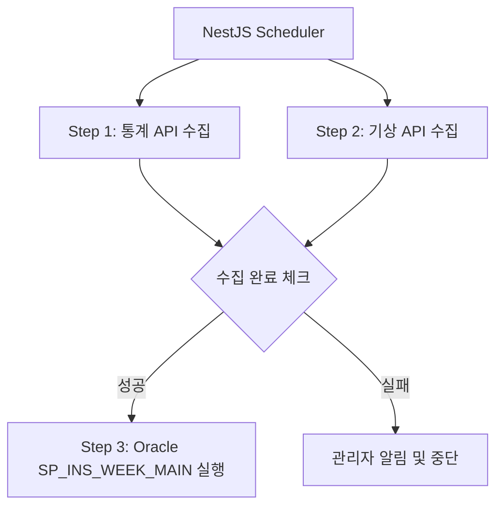

# Batch Orchestration Implementation Plan

이 문서는 기존 Oracle Job 기반의 주간 리포트 생성 프로세스를 NestJS 기반의 오케스트레이션 방식으로 전환하기 위한 가이드입니다.

---

## 1. 현황 분석 (Oracle 기반)

### 99_JOB_INS_WEEKLY.sql 분석
*   **JOB 명칭:** `JOB_INS_WEEKLY_REPORT`
*   **실행 주기:** 매주 월요일 02:00 (KST)
*   **주요 동작:** `SP_INS_WEEK_MAIN('WEEK', NULL)` 프로시저 호출
*   **한계점:** 외부 API(통계, 기상)와의 연동이 어렵고, 데이터 수집 완료 후 실행되는 순차적 제어가 불가능함.

---

## 2. 변경된 프로세스 설계

프로세스의 안정성과 효율성을 위해 NestJS를 **오케스트레이터(Orchestrator)**로 활용합니다.



### 주요 변경 사항
1.  **Oracle Job 비활성화:** 기존 `JOB_INS_WEEKLY_REPORT`는 더 이상 사용하지 않거나 비활성화합니다.
2.  **NestJS @Cron 도입:** NestJS 서버에서 스케줄링을 관리합니다.
3.  **병렬 처리:** Step 1과 Step 2를 동시에 실행하여 전체 시간을 단축합니다.

---

## 3. 상세 구현 계획 (VS Code 기반)

### Step 1: BatchService 고도화
`api/src/modules/batch/batch.service.ts` 파일에 오케스트레이션 로직을 구현합니다.

*   **통계 데이터 수집:** 외부 API 호출 후 전용 테이블(`TA_STATS_DATA` 등)에 저장.
*   **기상 데이터 수집:** `TA_FARM` 테이블에서 좌표를 조회하여 농장별로 API 호출 후 `TM_WEATHER` 테이블에 저장.
*   **프로시저 호출:** 모든 데이터 저장이 완료된 후 `DataSource.query()`를 통해 `SP_INS_WEEK_MAIN` 실행.

### Step 2: SQL 쿼리 정의
`api/src/modules/batch/sql/batch.sql.ts`에 필요한 쿼리를 추가합니다.
*   대상 농장 조회 쿼리 (이미 존재)
*   통계 데이터 Insert 쿼리
*   기상 데이터 Insert/Upsert 쿼리

### Step 3: 스케줄러 등록
`api/src/modules/batch/batch.service.ts` 또는 별도의 스케줄러 모듈에 `@Cron`을 등록합니다.

```typescript
// 예시: 매주 월요일 새벽 2시 실행
@Cron('0 0 2 * * 1')
async handleWeeklyBatch() {
    await this.runWeeklyBatch('WEEK');
}
```

---

## 4. 수행 가이드 (VS Code 작업 순서)

1.  **환경 설정:** `api/.env` 파일에 외부 API 키 및 URL 설정 여부 확인.
2.  **서비스 수정:** `BatchService.ts`에서 `collectStatsData`와 `collectWeatherData`의 실제 API 호출 로직 구현.
3.  **에러 핸들링:** API 호출 실패 시 재시도 로직(Retry) 또는 로그 기록 로직 강화.
4.  **테스트:**
    *   VS Code 터미널에서 `npm run start:dev` 실행.
    *   Postman 또는 `batch.controller.ts`를 통해 `/batch/run` 엔드포인트로 수동 트리거 테스트.
5.  **Oracle Job 중단:** DB에서 기존 JOB을 `DISABLE` 처리.
    ```sql
    EXEC DBMS_SCHEDULER.DISABLE('JOB_INS_WEEKLY_REPORT');
    ```

---

## 5. 기대 효과
*   **순서 보장:** 데이터 수집이 완료된 후 리포트가 생성되므로 데이터 정합성 확보.
*   **확장성:** 향후 다른 외부 데이터(축평원 등) 연계 시 NestJS에서 손쉽게 추가 가능.
*   **모니터링:** NestJS 로그와 `TS_INS_JOB_LOG`를 통해 통합 모니터링 가능.
